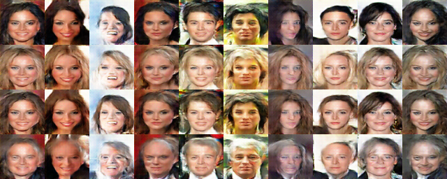

label_processing
======================================================

The code is tested on Linux operating system with Python 2.7 or 3.x, TensorFlow 1.4.0.

#### label_processing
*Name* | *All_classes* | *classes_style_by_style* 
:---: | :---: | :---: |
ACGAN |  | 
*Name* | *Black_Hair* | *Blond_Hair* 
ACGAN |  | 
  *Name* | *Brown_Hair* | *Gray_Hair* 
ACGAN |  | 

author: 武广

email: twistedwg@hotmail.com

